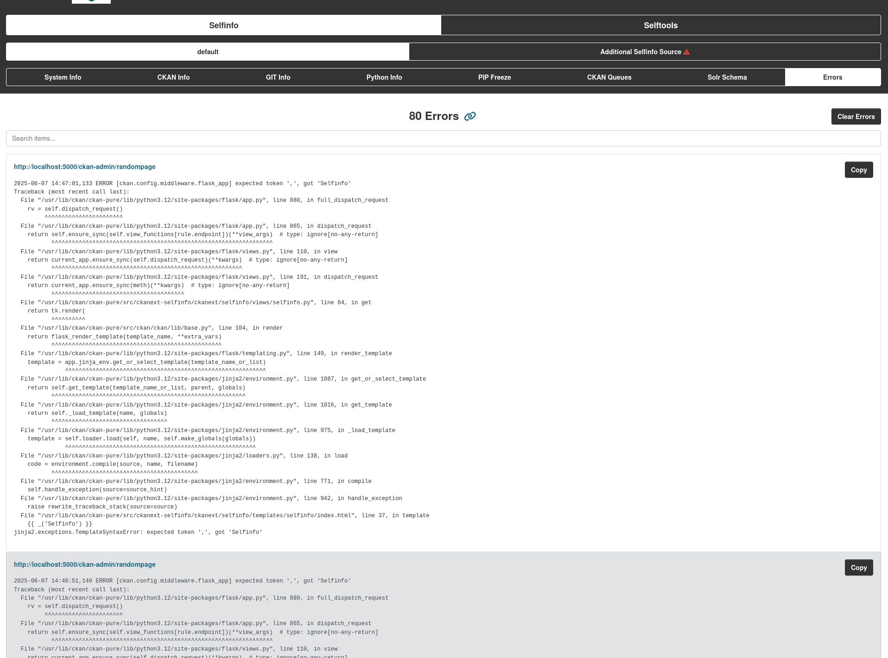

## Enable Error Storage

To enable error tracking, add and modify the following sections in your CKAN INI file.

After the `handler_console` section, add:

    [handler_selfinfoErrorHanlder]
    class = ckanext.selfinfo.handlers.SelfinfoErrorHandler
    level = ERROR
    formatter = generic

In the `[handlers]` section, add `selfinfoErrorHanlder` to the keys:

    [handlers]
    keys = console, selfinfoErrorHanlder

In the `[logger_ckan]` section, add the handler:

    [logger_ckan]
    level = INFO
    handlers = console, selfinfoErrorHanlder
    qualname = ckan
    propagate = 0

In the `[logger_ckanext]` section, add the handler:

    [logger_ckanext]
    level = DEBUG
    handlers = console, selfinfoErrorHanlder
    qualname = ckanext
    propagate = 0
