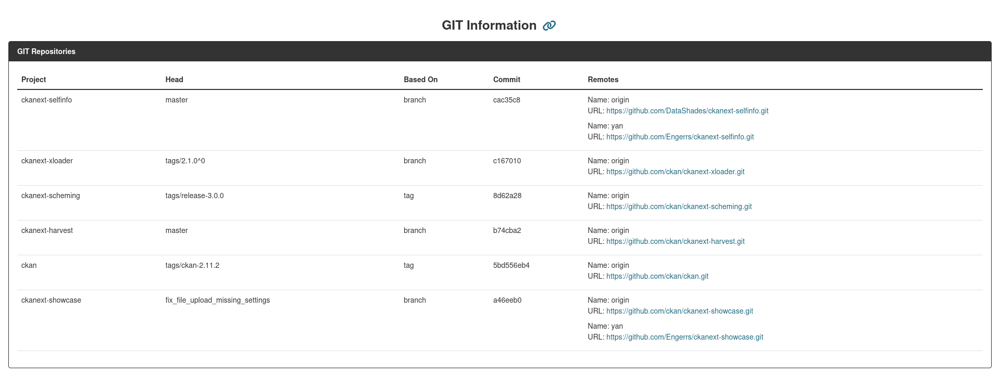

## Enable Git Information

To enable Git information tracking, add the `ckan.selfinfo.ckan_repos_path` configuration parameter. This should point to the directory where your CKAN extensions are stored.

!!! warning "File Permissions"
    The user running the CKAN application must have read access to the repository directories. If permissions are insufficient, errors will be displayed under **Repos with errors** on the Git Info tab.

Optionally, you can use `ckan.selfinfo.ckan_repos` to specify which repositories to track. By default, Selfinfo will attempt to read all repositories in the configured directory.