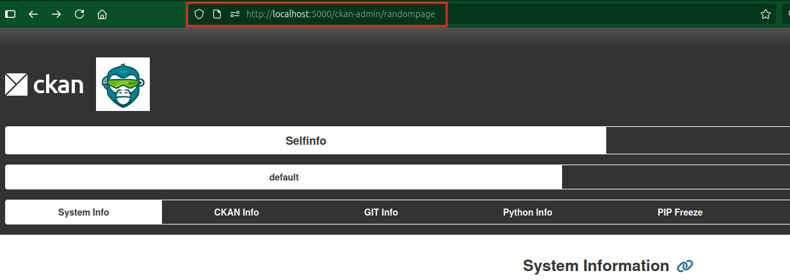

## Secure URL and Action Name

By default, the Selfinfo page is registered at `/ckan-admin/selfinfo` and is protected only by sysadmin access verification.

### Custom Page URL

To add an additional layer of security through obscurity, you can customize the page URL using `ckan.selfinfo.page_url`. This prevents unauthorized users from discovering the Selfinfo interface location.

### Custom API Action Name

Similarly, you can customize the API action name for the Selfinfo endpoint. By default, it uses `get_selfinfo`, but you can change it with `ckan.selfinfo.main_action_name`.

!!! note "Security by Obscurity"
    While custom URLs and action names add a layer of protection, they should not be considered a replacement for proper authentication and authorization mechanisms.