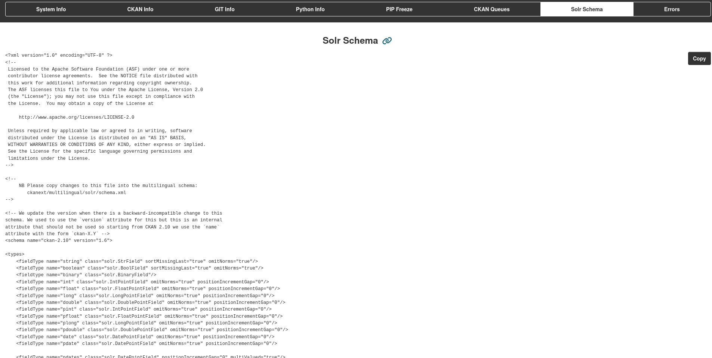

## Enable Solr Schema

To enable Solr schema display, add the `ckan.selfinfo.solr_schema_filename` configuration parameter with the filename that Solr uses for your schema.

Depending on your Solr configuration, the schema file may be named:

- `managed-schema` (modern Solr versions)
- `schema.xml` (legacy configurations)

You can find the correct filename in your Solr Core directory under the `conf/` folder.

!!! info "Configuration Required"
    If `ckan.selfinfo.solr_schema_filename` is not configured, the Solr Schema tab will not appear in the interface.
