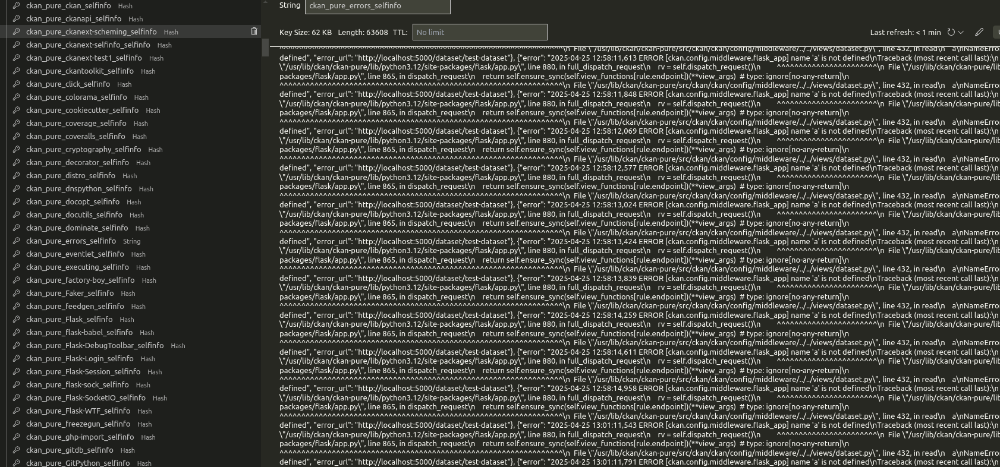

## Unique Redis Key per Portal Instance

By default, Selfinfo stores data (such as errors and Python modules) under standard Redis keys. If multiple CKAN portals or instances share the same Redis server, they may interfere with each other's data.

### Configuration

To prevent conflicts, configure a unique Redis prefix key using `ckan.selfinfo.redis_prefix_key`. This separates data for each portal or instance.

**Example:**

Setting `ckan.selfinfo.redis_prefix_key = production_portal` will store error data under the key `production_portal_errors_selinfo`.

!!! tip "Multi-Instance Setup"
    When running multiple CKAN instances against the same Redis server, always configure unique prefix keys to avoid data collisions.
