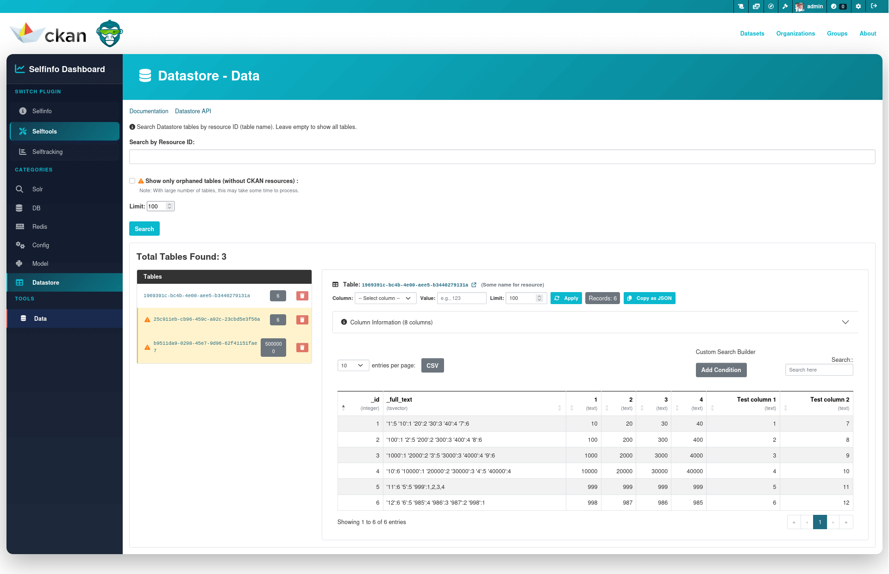

# Datastore Category

Datastore Category provides comprehensive tools for managing CKAN Datastore tables directly from the UI. It allows you to browse, inspect, filter, and delete datastore tables with advanced features for identifying orphaned tables (tables without corresponding CKAN resources).

All modification operations are password-protected to prevent accidental data loss.

## Query

Browse and search through all datastore tables in your PostgreSQL database.

**Features:**

- **Search**: Filter tables by name using pattern matching
- **Orphaned tables detection**: Checkbox to show only tables without corresponding CKAN resources (highlighted in yellow)
- **Batch processing**: Efficiently handles large numbers of tables (processes in batches of 1000)
- **Table information**: Displays table name, record count, and resource link (if exists)
- **Two-column layout**: Tables list on the left, detailed data view on the right

**Orphaned tables** are tables that exist in the datastore but don't have a corresponding resource in CKAN. This typically happens when:
- Resources were deleted from CKAN but datastore tables weren't cleaned up
- Import processes failed partially
- Manual database operations created tables outside of CKAN

## Table Data

View and filter data from any datastore table with advanced filtering capabilities.

**Features:**

- **Column metadata**: View all column names with PostgreSQL data types in an expandable accordion
- **Custom limit**: Set record limit from 1 to 100,000 (default: 1000)
- **Column filtering**: Select a column from dropdown and filter by specific value
- **Interactive table**: Powered by DataTable.js with pagination, search, and sorting
- **CSV export**: Export filtered results to CSV file
- **Resource linking**: Direct link to CKAN resource page (if table is linked to a resource)
