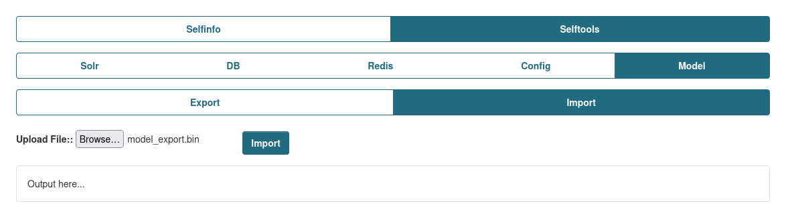

Model category allows to Export/Import data based on CKAN Models, bypassing the original validation for the schemas to replicate data as it is on other envs for testing, replicating broken data from remotes instances, updating data, migrate data without using DB dumps.

There currently predefined Models list that can be chosen from, but this list can be extended, please read on how to do so [here](../extending_selftools.md).
This is highly recommend.

Both Export and Import can be additionally secured by setting the `ckan.selftools.opetations_pwd`, this will allow to additionally protect the actions from external/internal usage. You can find the setting for it [here](../config_settings.md)

## Export

Provides and ability to Export CKAN data.


Currently the exported file is compressed using `gzip`.

### Encryption
You also can secure the exported data by encrypting it, while providng an key for encryption using  `ckan.selftools.model_key_ecryption` config setting. This encrypt using `cryptography.fernet` and use the provided key to decrypt it while Importing stage to secure the exported data.

To generate an key you can run this in you console under activated Virtualenv and installed Selfinfo extension, then copy the generated key and set it in the mentioned above CKAN config setting.
```python
from cryptography.fernet import Fernet
Fernet.generate_key()
```

### How it works?
While you chose an Model to export, beside the Model data, it will also gather all of its relationships registered for this Model and store this information in `JSON` format.
Also there is an ability to provides custom relationships to other Models using `Custom Relationships` fields.

For example lets use `Package` model and it covers all features.

While exporting `Package` model, it returns all rows that in the DB for this Model and data of the `Models it has relationships to`, like `PackageExtra` or `PackageTag`, but while those relationships are registered, there other relationships that are not like `Group` and `User`. So in order to attach them as well, you need to specify `Custom Relationships`.
The Custom Relationship will look like this, where the Local specifies local column of the Model (e.g. Package) and Remote the column of the remote Model (e.g. Group). After adding those, you be able to see them in the Preview list.


Need to keep in mind, that the Custom Relationships doesn't related only to current chosed model, but can be specified other Models that can appear in the chain of relationships for the current model as it checks for those Relationships for each Row individually.

Also, while exoprting for example 100 Packages that related to only 1 Organization, the Organization will appear only once in the JSON list, so there won't be duplicates, which can increase loading time while importing and size of the exported file.


## Import

Provides an ability import the exported file to re-create the data on the internal/external portals.

You should be able to provide both compressed or compressed and encrypted files.

Keep in mind, that the Export adds all possible Relationships, even those that are not specified in the default Models list. So if you have issues while Importing or having an custom Models that are not present in the list, try to add them according to [this solution](../extending_selftools.md), as Import won't be aware of those and can throws errors while importing process.


Known issues:

* While import Users, their passwords will be changed. This is due to User Model logic while assigning password to the model.


