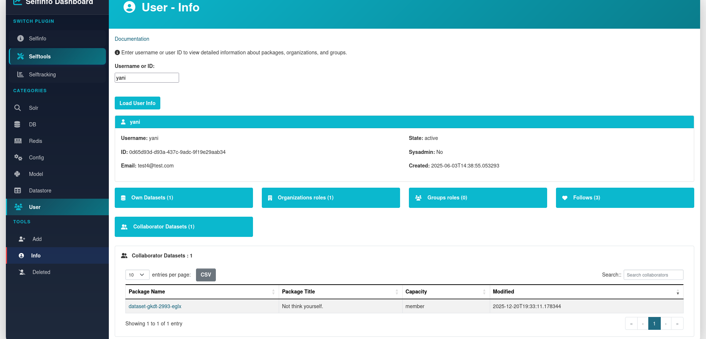
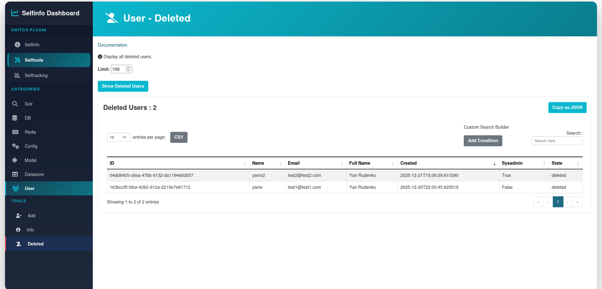

User category provides tools for managing CKAN users through a convenient UI interface. These tools allow administrators to view user information, add new users, and manage deleted users.

All operations in this category can be additionally secured by setting the `ckan.selftools.operations_pwd` config setting, which will require password confirmation for sensitive actions. You can find the setting for it [here](../config_settings.md)

## Add

Provides the ability to create new CKAN users through a web interface.


### Features

- **Required Fields**: Username, Email, Password (minimum 8 characters), Password Confirmation
- **Optional Fields**: Full Name
- **Extra Fields**: Accepts custom user attributes as JSON format (e.g., `{"department": "IT", "phone": "+1234567890"}`)
- **Password Protection**: All user creation operations require password confirmation via modal dialog
- **Validation**: 
  - Email format validation
  - Password length validation (minimum 8 characters)
  - Password confirmation matching
  - JSON format validation for extra fields

### How it works

When you fill out the form and submit it, the tool:

1. Validates all required fields (username, email, password, password confirmation)
2. Checks that passwords match
3. Parses and validates JSON from Extra Fields (if provided)
4. Calls CKAN's `user_create` action with the provided data
5. Returns the newly created user ID and username on success

The Extra Fields feature allows you to set custom user attributes that may be used by other CKAN extensions or for storing additional metadata about users.

**Example Extra Fields JSON:**
```json
{
  "department": "Data Science",
  "employee_id": "EMP001",
  "phone": "+1234567890"
}
```

## Info

Provides comprehensive information about CKAN users and their associated data.



### Features

The Info tool displays user details and provides buttons to view:

- **Own Datasets**: All packages created by the user
- **Organizations**: Organizations where the user has a role (admin, editor, or member)
- **Groups**: Groups where the user has a role
- **Follows**: Entities (datasets, users, organizations) that the user follows
- **Collaborator Datasets**: Datasets where the user is a collaborator (only visible when `ckan.auth.allow_dataset_collaborators` is enabled)

### How it works

Enter a username and click "Get User Info" to retrieve:

- User ID
- Username
- Full Name
- Email
- User State (active/deleted)
- System Administrator status
- Creation date
- Counts of packages, organizations, groups, follows, and collaborations

Each button dynamically loads detailed information:

- **Own Datasets**: Shows package name, title, state, privacy status, and creation date
- **Organizations**: Shows organization name, title, role, and state
- **Groups**: Shows group name, title, role, and state  
- **Follows**: Shows followed entities with direct links and type (dataset/user/group/organization)
- **Collaborator Datasets**: Shows package name, title, capacity, and last modified date

All data tables support:

- Search functionality
- Sorting by columns
- CSV export
- Pagination

## Deleted

Provides the ability to view all deleted CKAN users.



### Features

- **View Deleted Users**: Lists all users marked as deleted in the system

### How it works

The Deleted tool shows a table of all users with state "deleted", including:

- Username
- Email
- Full Name

The table supports:

- Search functionality
- Sorting by columns
- CSV export
- Pagination

This tool is useful for administrators to review which users have been deleted from the system.
