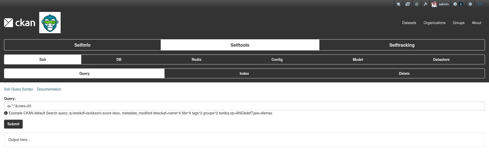

## Selftools

This plugin suggested to be an addition to Selfinfo tools, but considered to be moved to a separate plugin, due to difference in main idea and purpouse of Selfinfo.

Unlike Selfinfo, where you retrieve information about CKAN setup, Selftools provides an actual data that stored for CKAN and be able to do manipulations with it like create/update/delete operations.

Currently there few categories that comes out of the box and in future, there might be more categories and the existing tools will get more and more functionality overtime.

Categories:

* **[SOLR](categories/solr.md)**
    - [Query](categories/solr.md#query)
    - [Index](categories/solr.md#index)
    - [Delete](categories/solr.md#delete)
* **[DB](categories/db.md)**
    - [Query](categories/db.md#query)
    - [Update](categories/db.md#update)
* **[Redis](categories/redis.md)**
    - [Query](categories/redis.md#query)
    - [Update/Create](categories/redis.md#updatecreate)
    - [Delete](categories/redis.md#delete)
* **[Config](categories/config.md)**
    - [Query](categories/config.md#query)
* **[Model](categories/model.md)**
    - [Export](categories/model.md#export)
    - [Import](categories/model.md#import)
* **[Datastore](categories/datastore.md)**
    - [Data](categories/datastore.md#data)
* **[User](categories/user.md)**
    - [Add](categories/user.md#add)
    - [Info](categories/user.md#info)
    - [Deleted](categories/user.md#deleted)

Those categories can be used an many cases when quick fix is required on remote Environments or for investigation in combination with Selfinfo Errors category.

Each category has its own separate page, where all of their functionality is shown and described.
