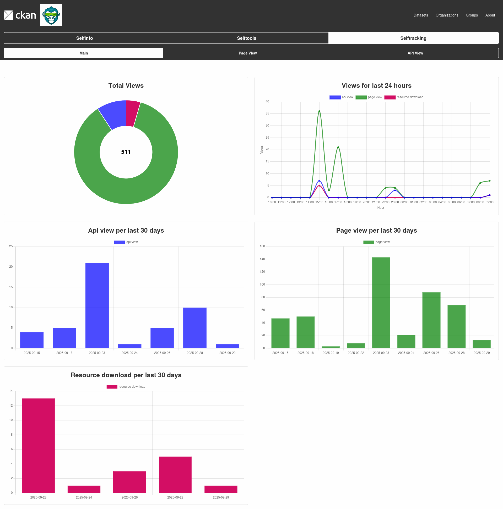

## Selftracking

This CKAN extension provides a lightweight tracking system for monitoring how users interact with your data portal. It captures three main types of events:

**Page views** – Track visits to datasets, resources, organizations, or any other portal pages.

**API usage** – Record calls made to CKAN API endpoints to better understand programmatic access.

**Custom tracks** – Log specific user actions, such as resource downloads or other interactions you want to monitor. Check custom events section for more details.

The tracking is designed to run efficiently without adding overhead to CKAN’s normal operations. Collected data can be used for analytics, reporting, or integration with external monitoring tools, helping administrators understand portal usage patterns and user behavior.

Out of the box only **Page View** and **API View** categories are available without modifications.

### How it works?

While visiting page, in order not to interact with the DB it stores the action in Redis special list. After finalizing the [Configuration](configuration.md) step 4, it then from Redis should appear in your DB.
Same goes for custom registered track types mentioned in [Custom Tracks](custom_tracks.md).
