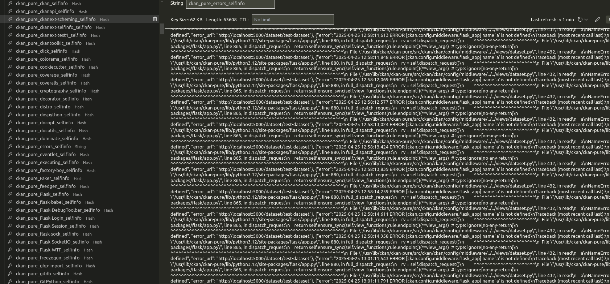

## Unique Redis key per portal/instance

By default, Selfinfo will store some of the Data like Errors or Python Modules under standard Redis keys and if you have another portal/instance connected to same Redis, they might interfere with each other, which is not what we want.

To avoid this, you can add an unique Redis prefix key, that will allow you to separate one portal/instance from another. To do so, add `ckan.selfinfo.redis_prefix_key` config param with an unique prefix key.

Example: adding `random_key` will store the data under `random_key_errors_selinfo`.

